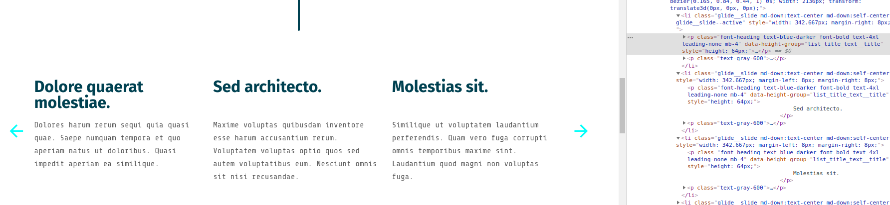

# Height Group

Use it if you want that elements have the same height
<br/>
(ex: listing of cards where you want that all title wrappers
have the same height)

<br/>

| Element | Data attribute
| :--------: | :-----: |
| Targets | `data-height-group` |

### HTML
Add same value at data attribute `data-height-group` for a group

``` html
<ul class="list">
    <li class="list__item">
        <p data-height-group="listTitle">Title 1</p>
        <p data-height-group="listTitle">Title 2</p>
        <p data-height-group="listTitle">Title 3</p>
    </li>
</ul>
```

<br/>

[](https://www.hprod.asdoria-web-agency.com/clients/bymycar)
