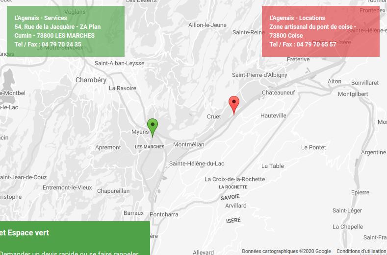

# Google Map

| Element | Class
| :--------: | :-----: |
| Wrapper  | `js-map` |
| Position  | `js-map-child` |

### HTML (ex: on Erebor project)

``` html


    
    
    

    <section>
        <div class="o-full">
            <div class="v-contact-map-wrapper js-map"
             data-google-map-api-key="{{ configuration.request.server.get('GOOGLE_MAP_API_KEY') }}"></div>
            <span class="js-map-child"
                  data-lat="{{ lat }}"
                  data-lng="{{ lng }}"
                  data-marker="{{ marker.path|imagine_filter('original') }}"></span>
        </div>
    </section>

```

### CSS 
``` css
// Wrapper
.v-contact-map-wrapper {
    height: 576px;
}
```

<br/>

***

### Use multiples positions (ex: on Wordpress project)

``` html
<div class="m-page-header-right contact-map">
    <div class="m-page-header-right-wrapper contact-map-wrapper js-map"></div>
    <span class="js-map-child"
          data-lat="<?= $map_locations['lat']; ?>"
          data-lng="<?= $map_locations['lng']; ?>"
          data-address="<?= $map_locations['address']; ?>"></span>
    <span class="js-map-child"
          data-lat="<?= $map_services['lat']; ?>"
          data-lng="<?= $map_services['lng']; ?>"
          data-address="<?= $map_services['address']; ?>">
    </span>
</div>
```
[](https://www.lagenais.com/contact/)
